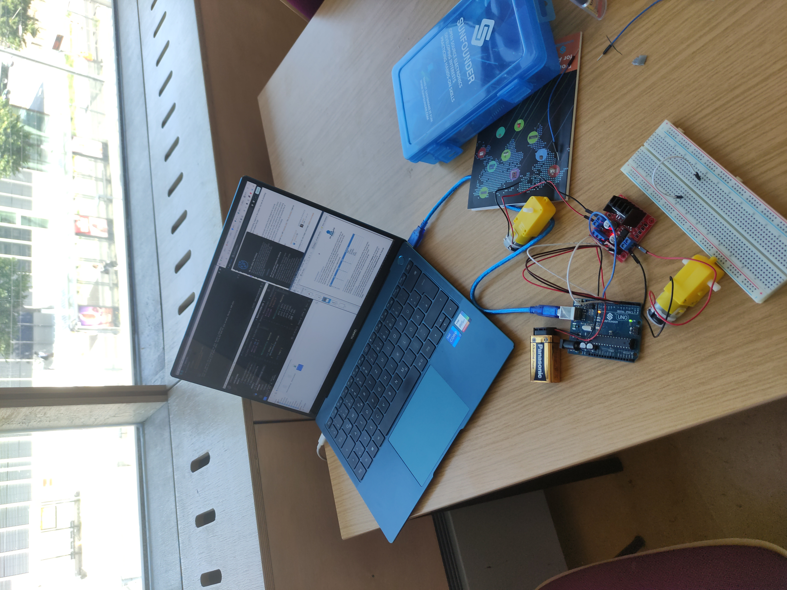

# Motor Controller Library



Allows to run a L298N motor controller

## Connect the component
The component requires 6 pins from the Arduino.
Connect pins to ENA, ENB, and IN1-4. 
IN1-4 must be capable of digitalWrite and ENA/ENB must be capable to analogWrite. Normal number pins will suffice.

In addition a power source up to 12 volt should be connected to the 12V connector. Next to it, is the ground connector.

The 5V connector next to it may power the Arduino. In that case, connect Arduino's ground to the coponent and further connect the ground to power source.

## Example implementation

```C
/*
  Library for a L298N Microcrontroller
*/

#include <MotorController.h>

#define IN1 2
#define IN2 3
#define IN3 4
#define IN4 5

#define ENA 8
#define ENB 7


MotorController motorController(IN1, IN2, IN3, IN4, ENA, ENB);

void setup() {
  motorController.setup();
}

void loop() {

  motorController.speed(200);
  motorController.forward();

  delay(5000);

  motorController.speed_change(-100);
  motorController.backward();

  delay(5000);
  
  motorController.speed_change(-50);
  motorController.left();
  
  delay(5000);
  
  motorController.speed(150);
  motorController.right();
  
  delay(2500);

  motorController.speed(250);
  motorController.stop();
  
  delay(2500);

  motorController.speed(0);
  motorController.forward();

  delay(5000);
}
```
